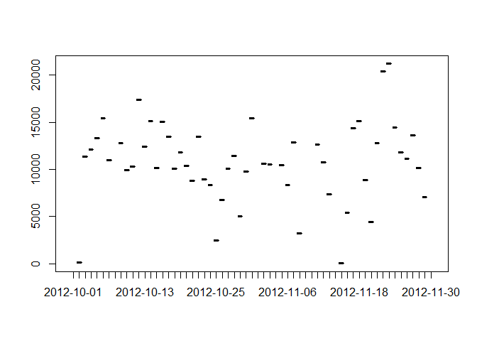
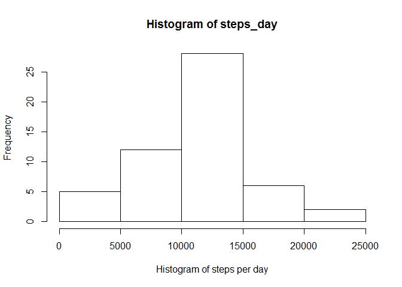
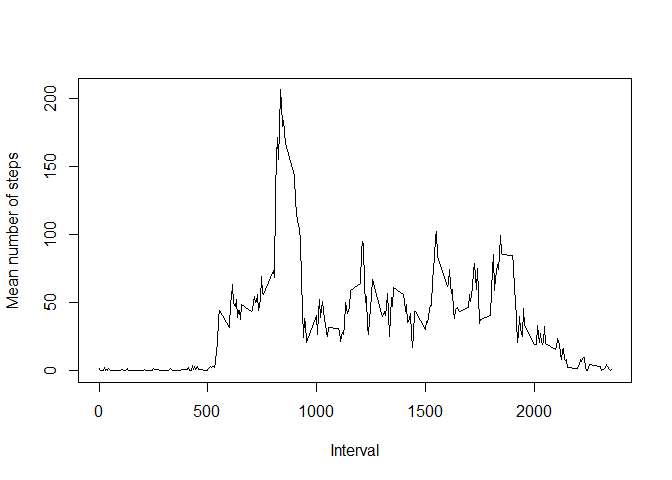
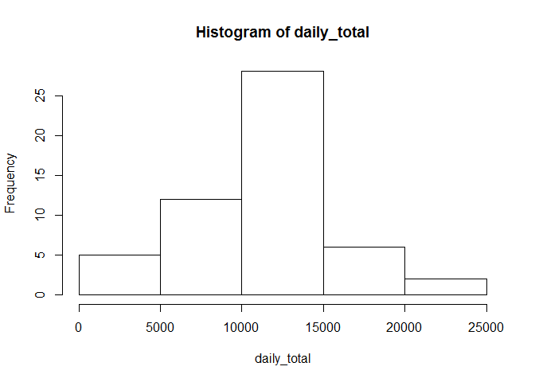
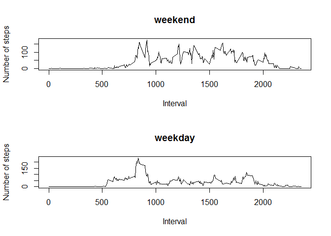

# Reproducible Research: Peer Assessment 1

### Basic settings

```r
echo = TRUE  # Code visible
```

## Loading and preprocessing the data


```r
data <- read.csv("activity.csv")
data <- na.omit(data)
```


## What is mean total number of steps taken per day?

Total number of steps per day


```r
data_day <- aggregate(data$steps, list(day=data$date), sum)
plot(data_day$day, data_day$x)
```

 

```r
print("\n")
```

```
## [1] "\n"
```

Histogram of steps per day


```r
steps_day <- tapply(data$steps, data$date, sum)
hist(steps_day, xlab="Histogram of steps per day")
```

 

Mean and Median


```r
mean <- mean(steps_day, na.rm=TRUE)
median <- median(steps_day, na.rm=TRUE)
```

The mean in 1.0766189\times 10^{4} and the media 10765

## What is the average daily activity pattern?

Average of steps in each 5 minute interval and we plot it

```r
Five_mean_interval <- tapply(data$steps, data$interval, mean, na.rm=TRUE)
intervals <- data$interval[1:288]
plot(intervals, Five_mean_interval, type="l", xlab="Interval", ylab="Mean number of steps")
```

 

Which is the interval withe the maximum number of steps on average?

```r
maximum_interval <- intervals[which.max(Five_mean_interval)]
```
The interval is 835

## Imputing missing values

Number of NAs is 'r sum(!is.na(data$steps))'

Filling with the mean


```r
for (i in 1:length(data$steps)) {
    if (is.na(data$steps[i])) {
        data$steps[i] <- mean(data$steps[data$interval == data$interval[i]], na.rm=TRUE)
    }
}
```
New histogram

```r
daily_total <- tapply(data$steps, data$date, sum)
hist(daily_total)
```

 

```r
print("\n")
```

```
## [1] "\n"
```
New mean and median.

```r
mean_per_day <- mean(daily_total, na.rm=TRUE)
median_per_day <- median(daily_total, na.rm=TRUE)
```
The mean is 1.0766189\times 10^{4} and the median is 10765.

The mean is the same, but the median is different.

## Are there differences in activity patterns between weekdays and weekends?

Here the plots for weekdays and for weekends


```r
wd <- weekdays(as.Date(data$date))
weekend <- (wd == "sábado" | wd == "domingo")

weekend_mean <- tapply(data$steps[weekend], data$interval[weekend], mean)
weekday_mean <- tapply(data$steps[!weekend], data$interval[!weekend], mean)

par(mfrow=c(2,1))
plot(intervals, weekend_mean, type="l", xlab="Interval", ylab="Number of steps", main="weekend")
plot(intervals, weekday_mean, type="l", xlab="Interval", ylab="Number of steps", main="weekday")
```

 
